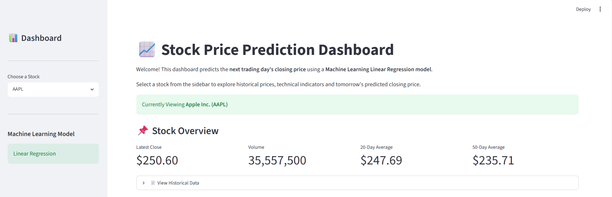
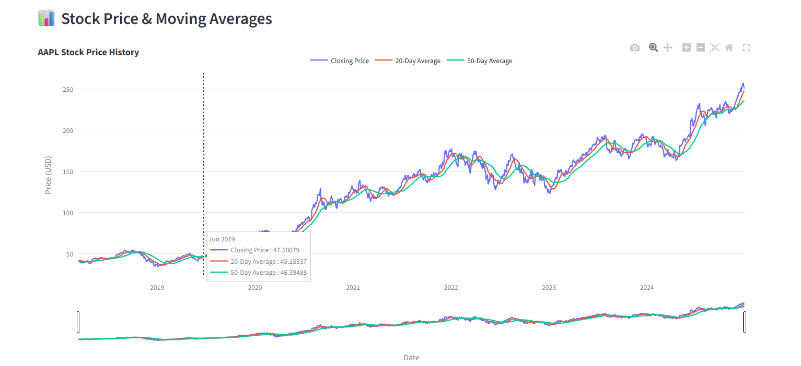
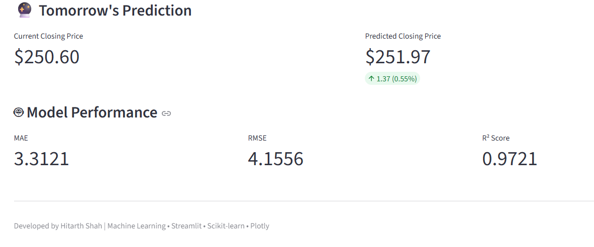

# 📈 Stock Price Prediction Dashboard

# 📈 Stock Price Prediction Dashboard


A Machine Learning-powered web application that predicts the next day's stock closing price using historical stock market data.

## 🚀 Live Demo

https://stock-price-prediction-dashboard-dxg4kx3hpe6yxjdavpuy88.streamlit.app/

---

## 📌 Features

- 📊 Predicts the next day's closing stock price
- 📈 Interactive Plotly charts
- 📉 20-Day & 50-Day Moving Averages
- 🤖 Machine Learning model for prediction
- 📋 Model evaluation metrics (MAE, RMSE, R²)
- 📦 Supports multiple stocks:
  - Apple (AAPL)
  - Microsoft (MSFT)
  - Google (GOOG)
  - Amazon (AMZN)
  - Tesla (TSLA)

---

## 🛠 Technologies Used

- Python
- Pandas
- NumPy
- Scikit-learn
- Streamlit
- Plotly
- yFinance
- Joblib

---

## 📂 Project Structure

```
stock-price-prediction/
│
├── app/
│   └── app.py
│
├── data/
│   ├── raw/
│   └── processed/
│
├── models/
│
├── notebooks/
│
├── src/
│
├── requirements.txt
├── README.md
└── main.py
```

---

## 📊 Machine Learning Workflow

1. Data Collection using Yahoo Finance
2. Data Cleaning
3. Feature Engineering
4. Model Training
5. Model Evaluation
6. Prediction
7. Web Dashboard using Streamlit

---

## 📈 Model Performance

| Stock | MAE | RMSE | R² Score |
|-------|-----:|------:|---------:|
| AAPL | 3.31 | 4.16 | 0.972 |
| MSFT | 5.66 | 7.01 | 0.966 |
| GOOG | 2.91 | 3.92 | 0.957 |
| AMZN | 3.38 | 4.38 | 0.971 |
| TSLA | 9.80 | 14.29 | 0.946 |

---

## ▶️ Installation

Clone the repository

```bash
git clone <your-github-repository-url>
```

Move into the project directory

```bash
cd stock-price-prediction
```

Create a virtual environment

```bash
python -m venv venv
```

Activate it

Windows

```bash
venv\Scripts\activate
```

Install dependencies

```bash
pip install -r requirements.txt
```

Run the application

```bash
python -m streamlit run app/app.py
```

---

## 📌 Future Improvements

- XGBoost Model
- LSTM Deep Learning Model
- Candlestick Charts
- Live Stock Data
- Technical Indicators (RSI, MACD, Bollinger Bands)
- Compare Multiple Models

---

## ⚠ Disclaimer

This project is for educational purposes only and should not be considered financial advice.
## Dashboard



## chart




## Dashboard

